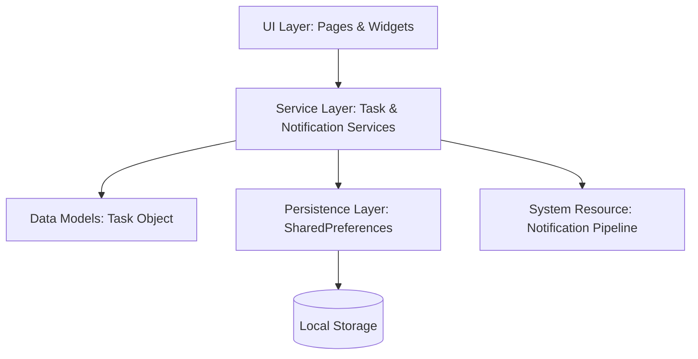

# 📝 Todo-LiSSSS (Informatics Overview)

**Todo-LiSSSS** (*To Do List Sangat Sederhana Simpel Sekali*) is a mobile application engineered with a focus on high-efficiency task management through minimalist informatics design. This project demonstrates the implementation of a robust local persistence layer and a localized notification system within the Flutter ecosystem.

---

## 🏛️ System Architecture

The application adheres to a decoupled layered architecture, ensuring separation of concerns between business logic, data persistence, and UI rendering.

### 🛰️ Technical Stack Specs
| Component | Technology | Role |
| :--- | :--- | :--- |
| **Execution Engine** | Flutter SDK (^3.9.2) | Cross-platform build & rendering |
| **State Logic** | Stateful Lifecycle Management | Real-time UI updates via transient state |
| **Data Persistence** | `shared_preferences` | JSON-serialized key-value local storage |
| **Scheduling** | `flutter_local_notifications` | Background notification pipeline |
| **Time Management** | `timezone` & `intl` | Geographic-aware scheduling & formatting |

---

## 💾 Informatics Implementation Highlights

### 1. Data Modeling & Persistence Layer
The core entity `Task` is designed as a serializable object.
- **Serialization**: Utilizes a `toJson()` and `factory Task.fromJson()` pattern.
- **Persistence Strategy**: Implements a middleware `TaskService` that handles high-level CRUD operations, abstracting the raw `SharedPreferences` interaction.
- **Constraint Logic**: Enforces a strict category limit (max 3 custom categories) to reduce cognitive load and data fragmentation.

### 2. Notification Pipeline & Logic Flow
The application utilizes an asynchronous notification service to manage hardware-level reminders.
- **Permission Handling**: Dynamic request for OS-level notification permissions.
- **Scheduling Algorithm**: Map-based scheduling where each `Task.id` acts as a unique notification identifier, allowing precise `cancel()` and `update()` operations.
- **Timezone Normalization**: Leverages the `timezone` package to ensure reminders are triggered accurately across different system locales.

### 3. UI/UX Informatics & Responsive Design
- **Visual Engine**: Implements **Glassmorphism** via `BackdropFilter` and `ImageFilter.blur`, optimizing visual hierarchy while maintaining performance.
- **Layout Architecture**: Utilizes `SlidingUpPanel` for a non-blocking dual-layer interface (Dashboard vs. List view).
- **Responsive Geometry**: Dynamic calculation of element sizes based on `MediaQuery` to ensure consistent density across varying aspect ratios.

---

## 📊 Data Schema Reference

| Field | Data Type | Description |
| :--- | :--- | :--- |
| `id` | `int` | Primary identifier (derived from epoch timestamp) |
| `title` | `String` | Task content |
| `done` | `bool` | Completion status |
| `deadline` | `DateTime?` | Optional temporal constraint (nullable) |
| `category` | `String?` | Optional taxonomy label (nullable) |

---

## 🎨 Design System

The application employs a curated color palette and modern UI primitives:
- **Primary Gradient**: Deep Purple (`#4A00E0`) to Vibrant Cyan (`#00BCD4`).
- **Surface**: Translucent White (`white.withOpacity(0.2)`) for Glassmorphism effects.
- **Typography**: Optimized hierarchy using standard Material Design weightings for legibility.

---

> [!NOTE]  
> This project serves as a technical showcase for implementing localized mobile services and maintaining high-performance UI states in a desktop-grade mobile environment.
